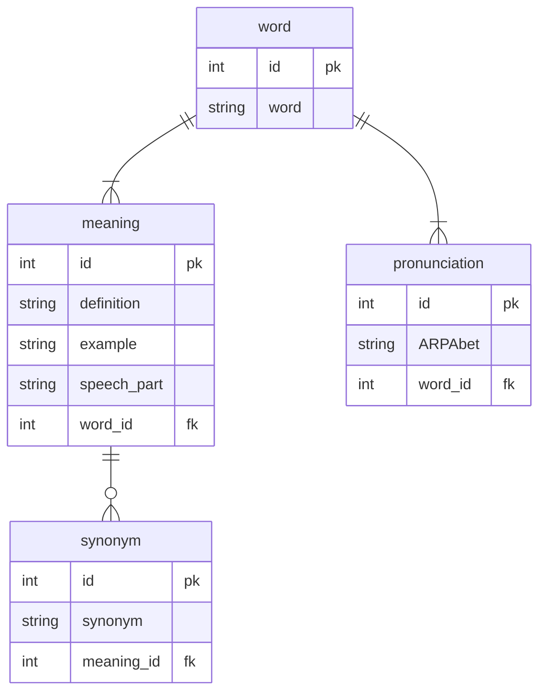
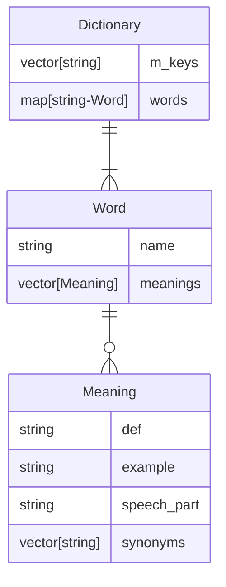

# random-word-generator
A Random Word Generator

Database Structure

```mermaid
---
title Database
---
erDiagram
    word||--|{meaning : ""
    meaning {
        int id pk
        string definition
        string example
        string speech_part
        int word_id fk
    }
    meaning||--o{synonym : ""
    word{
        int id pk
        string word
    }
    synonym{
        int id pk
        string synonym
        int meaning_id fk
    }
    word||--|{pronunciation : ""
    pronunciation {
        int id pk
        string ARPAbet
        int word_id fk
    }
```
Class Structure

```mermaid
---
title Class
---
erDiagram
    Dictionary||--|{Word : ""
    Dictionary {
        vector[string] m_keys
        map[string-Word] words
    }
    Word||--o{Meaning : ""
    Word{
        string name
        vector[Meaning] meanings
    }
    Meaning{
        string def
        string example
        string speech_part
        vector[string] synonyms
    }
```

Note to self: JSON parser does not include "labels" from WordSet. Maybe useful to include? Maybe not?
